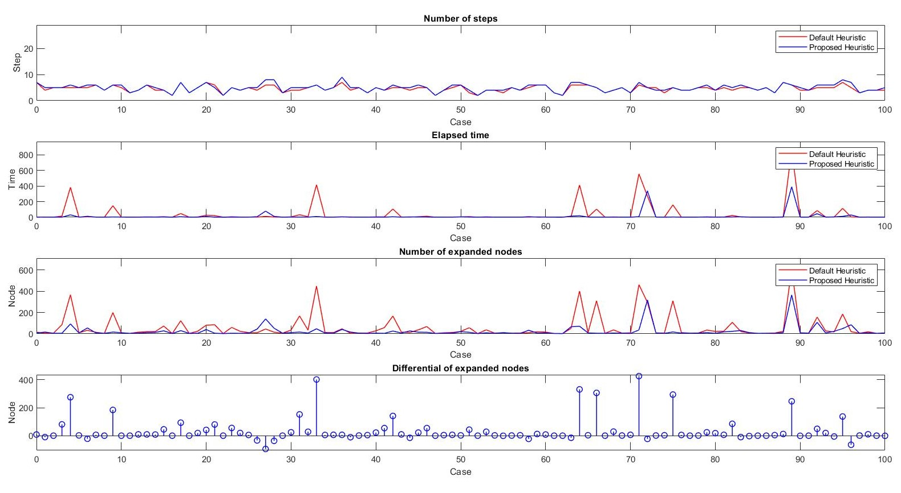

# Solving a Modified n-Queen Problem Using A* Algorithm

## Introduction
This program gives a solution for a modified version of the n-queen problem, where there are both queens and bishops on the board. The A* search algorithm with two different heuristic functions is used to find the solution.

## Heuristic Functions
The default heuristic function only counts the number of threats on the chessboard. The new proposed function considers specific weights for each threat type, including:
	Bishop-Bishop
	Queen-Queen
	Bishop_Queen
By using this new proposed heuristic function, the memory and time efficiency of the program was improved significantly. In addition, there are some cases that the default function takes a long time to find the solution. Some of this almost-impossible test cases can be found in the "Test Cases" folder
The figure below compares the efficiency of the proposed function with the traditional one.

